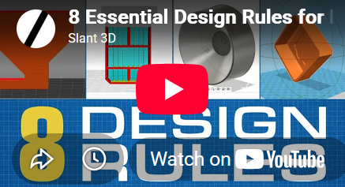
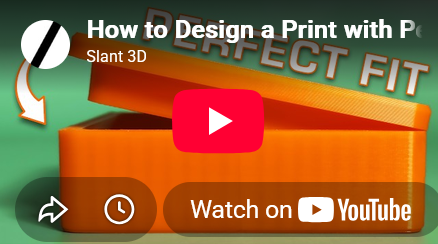
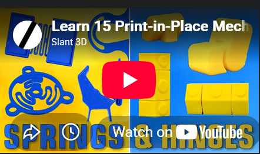
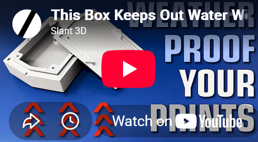
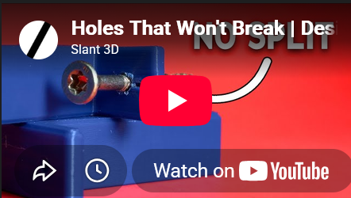

The [Design Principles for Reliably Printable 3D Models](./design-principles.md) are in large parts based on the resources listed below.

  
[8 Essential Design Rules for Mass Production 3D Printing](http://www.youtube.com/watch?v=1n_R8shlGcs)

In this episode of **Design** for Mass Production **3D** Printing, we cover it all. Discover 8 essential **3D** printing **design** tips to optimize ...

  
[How to Design a Print with Perfect Tolerance EVERY Time](http://www.youtube.com/watch?v=XKrDUnZCmQQ)

What if your parts just fit—every single time—no matter what printer, material, or slicer settings you use? In this video, we break ...

  
[Learn 15 Print-in-Place Mechanisms in 15 Minutes](http://www.youtube.com/watch?v=AAKsl8zW-Ds)

In this video, we break down 15 genius mechanisms that can be integrated into your **3D** printed products — no screws, ...

  
[This Box Keeps Out Water Without a Seal | Design for Mass Production 3D Printing](http://www.youtube.com/watch?v=prMUfQ9y7Rk)

Discover how **3D** printing enables the creation of waterproof electrical enclosures without ...

  
[Holes That Won't Break | Design for 3D Printing](http://www.youtube.com/watch?v=UfJIMn4nvsA)

**Designing** Strong **3D**\-Printed Wall Mounts — Fix Layer Splitting for Good Most **3D**\-printed ...
