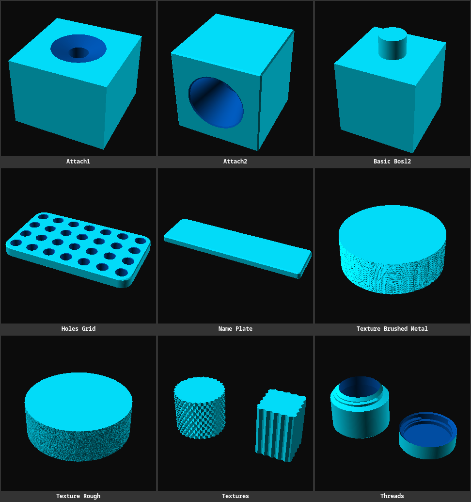

# BOSL2 Examples

Using OpenSCAD together with the BOSL2 library.

**Links**

- [Belfry OpenSCAD Library v2](https://github.com/BelfrySCAD/BOSL2/wiki#belfry-openscad-library-v2) (BOSL2)
- [BOSL2 Function Cheat Sheet](https://github.com/BelfrySCAD/BOSL2/wiki/Topics)
- [MakerWorld PMM OpenSCAD Reference](https://nelsonjchen.github.io/unofficial-makerworld-parametric-model-maker-openscad-docs/) (unofficial, [GitHub][gh-mw-pmm-docs])

**Models**

> 

- [basic-bosl2.scad](./basic-bosl2.scad) - Minimal BOSL2 example that attaches a cylinder to the top face of a cuboid using `attach()`. [🧊✏️][mw-basic-bosl2]
- [holes-grid.scad](./holes-grid.scad) - Perforated plate with a configurable rounded outline, chamfered edges, and repeated beveled holes. [🧊✏️][mw-holes-grid]
- [threads.scad](./threads.scad) - Flush threaded container and lid with a shared trapezoidal thread profile and ribbed grip. [🧊✏️][mw-threads]

[mw-basic-bosl2]: https://makerworld.com/en/makerlab/parametricModelMaker?from=model_page&modelName=basic-bosl2.scad&scadUrl=https%3A%2F%2Fraw.githubusercontent.com%2Fjhermann%2Fthings%2Frefs%2Fheads%2Fmain%2Fbosl2%2Fbasic-bosl2.scad
[mw-holes-grid]: https://makerworld.com/en/makerlab/parametricModelMaker?from=model_page&modelName=holes-grid.scad&scadUrl=https%3A%2F%2Fraw.githubusercontent.com%2Fjhermann%2Fthings%2Frefs%2Fheads%2Fmain%2Fbosl2%2Fholes-grid.scad
[mw-threads]: https://makerworld.com/en/makerlab/parametricModelMaker?from=model_page&modelName=threads.scad&scadUrl=https%3A%2F%2Fraw.githubusercontent.com%2Fjhermann%2Fthings%2Frefs%2Fheads%2Fmain%2Fbosl2%2Fthreads.scad
[gh-mw-pmm-docs]: https://github.com/nelsonjchen/unofficial-makerworld-parametric-model-maker-openscad-docs/tree/main
