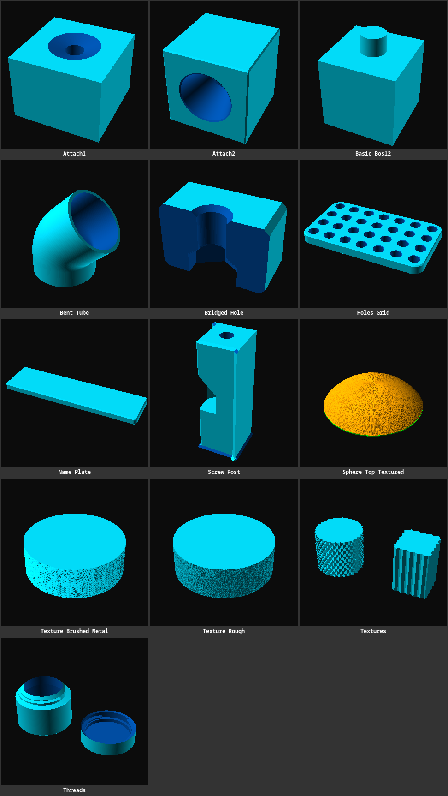
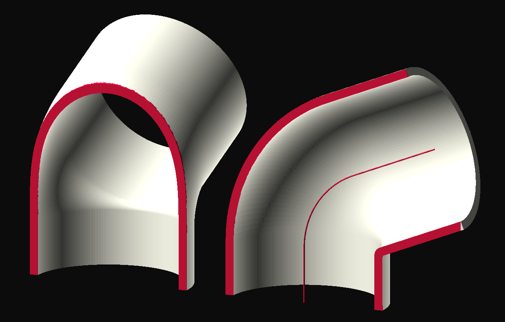
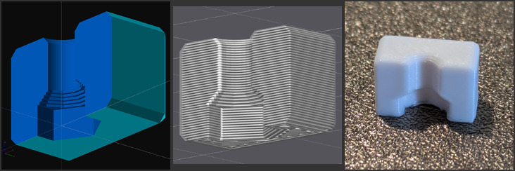
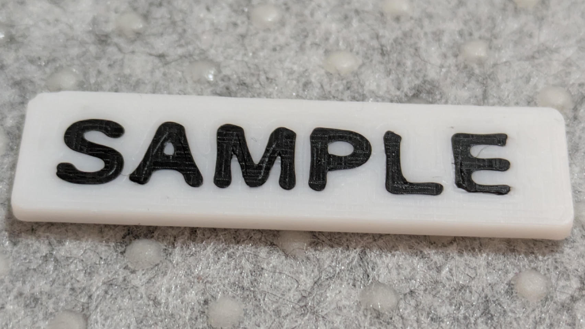
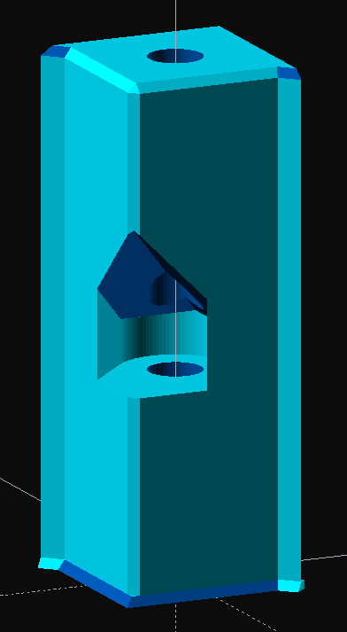
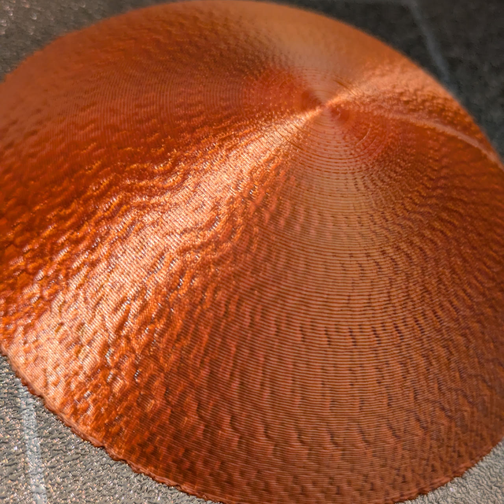
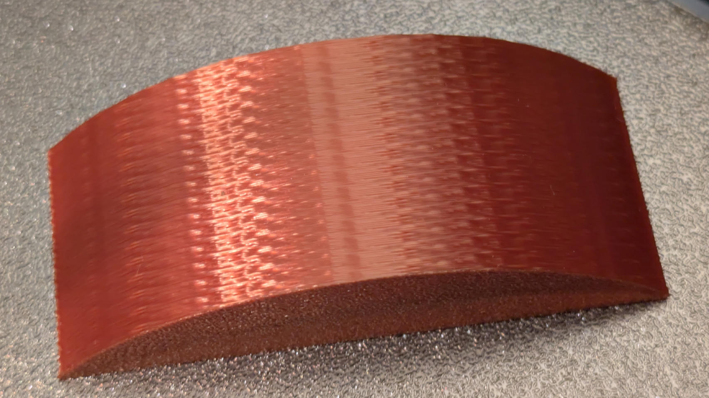
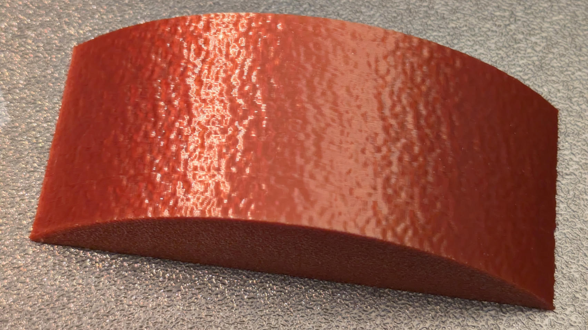

# BOSL2 Examples

Using OpenSCAD together with the BOSL2 library.

**Links**

- [Belfry OpenSCAD Library v2](https://github.com/BelfrySCAD/BOSL2/wiki#belfry-openscad-library-v2) (BOSL2)
- [BOSL2 Function Cheat Sheet](https://github.com/BelfrySCAD/BOSL2/wiki/Topics)
- [MakerWorld PMM OpenSCAD Reference](https://nelsonjchen.github.io/unofficial-makerworld-parametric-model-maker-openscad-docs/) (unofficial, [GitHub][gh-mw-pmm-docs])

**Models**

> 

- [basic-bosl2.scad](./basic-bosl2.scad) - Minimal BOSL2 example that attaches a cylinder to the top face of a cuboid using `attach()`. [🧊✏️][mw-basic-bosl2]
- [attach1.scad](./attach1.scad) - Demonstrates BOSL2 anchors and `attach()` by cutting an attached countersunk hole into a box. [🧊✏️][mw-attach1]
- [attach2.scad](./attach2.scad) - Demonstrates BOSL2 anchors and `attach()` by cutting a hole into the bottom of a cube. [🧊✏️][mw-attach2]
- [bent-tube.scad](./bent-tube.scad) - Hollow round tube swept along a polyline smooth path with `path_sweep()`, consisting of a straight section followed by a bend. [🧊✏️][mw-bent-tube]    
- [bridged-hole.scad](./bridged-hole.scad) - Cuboid with a hexagonal nut pocket at the bottom and a screw hole on top; the pocket roof is closed by one-layer bridging planes that step in alternately along X and Y, so it prints without supports. [🧊✏️][mw-bridged-hole]    
- [holes-grid.scad](./holes-grid.scad) - Perforated plate with a configurable rounded outline, chamfered edges, and repeated beveled holes. [🧊✏️][mw-holes-grid]
- [name-plate.scad](./name-plate.scad) - Configurable rounded name plate with recessed text. [🧊✏️][mw-name-plate]    
- [screw-post.scad](./screw-post.scad) - Chamfered square post for wall corners with a vertical screw hole from the top and a side slot for a retained nut. Prints without any supports. [🧊✏️][mw-screw-post]    
- [sphere-top-textured.scad](./sphere-top-textured.scad) - Demonstrates a rough texture applied to a revolved sphere cap, kept using `top_half()`. Sliced with adaptive layer heights. [🧊✏️][mw-sphere-top-textured]   
- [texture-brushed-metal.scad](./texture-brushed-metal.scad) - Demonstrates a brushed-metal texture applied to OpenSCAD geometry. [🧊✏️][mw-texture-brushed-metal]       *Red Copper PLA • rows 30 • cols 20 • depth 0.25*
- [texture-rough.scad](./texture-rough.scad) - Demonstrates the built-in rough texture applied to a cylindrical print. [🧊✏️][mw-texture-rough]       *Red Copper PLA • size 5×55 • depth 0.15*
- [textures.scad](./textures.scad) - Demonstrates built-in and custom BOSL2 textures on cylindrical and swept geometry. [🧊✏️][mw-textures]
- [threads.scad](./threads.scad) - Flush threaded container and lid with a shared trapezoidal thread profile and ribbed grip. [🧊✏️][mw-threads]

[mw-attach1]: https://makerworld.com/en/makerlab/parametricModelMaker?from=model_page&modelName=attach1.scad&scadUrl=https%3A%2F%2Fraw.githubusercontent.com%2Fjhermann%2Fthings%2Frefs%2Fheads%2Fmain%2Fbosl2%2Fattach1.scad
[mw-attach2]: https://makerworld.com/en/makerlab/parametricModelMaker?from=model_page&modelName=attach2.scad&scadUrl=https%3A%2F%2Fraw.githubusercontent.com%2Fjhermann%2Fthings%2Frefs%2Fheads%2Fmain%2Fbosl2%2Fattach2.scad
[mw-basic-bosl2]: https://makerworld.com/en/makerlab/parametricModelMaker?from=model_page&modelName=basic-bosl2.scad&scadUrl=https%3A%2F%2Fraw.githubusercontent.com%2Fjhermann%2Fthings%2Frefs%2Fheads%2Fmain%2Fbosl2%2Fbasic-bosl2.scad
[mw-bent-tube]: https://makerworld.com/en/makerlab/parametricModelMaker?from=model_page&modelName=bent-tube.scad&scadUrl=https%3A%2F%2Fraw.githubusercontent.com%2Fjhermann%2Fthings%2Frefs%2Fheads%2Fmain%2Fbosl2%2Fbent-tube.scad
[mw-bridged-hole]: https://makerworld.com/en/makerlab/parametricModelMaker?from=model_page&modelName=bridged-hole.scad&scadUrl=https%3A%2F%2Fraw.githubusercontent.com%2Fjhermann%2Fthings%2Frefs%2Fheads%2Fmain%2Fbosl2%2Fbridged-hole.scad
[mw-holes-grid]: https://makerworld.com/en/makerlab/parametricModelMaker?from=model_page&modelName=holes-grid.scad&scadUrl=https%3A%2F%2Fraw.githubusercontent.com%2Fjhermann%2Fthings%2Frefs%2Fheads%2Fmain%2Fbosl2%2Fholes-grid.scad
[mw-name-plate]: https://makerworld.com/en/makerlab/parametricModelMaker?from=model_page&modelName=name-plate.scad&scadUrl=https%3A%2F%2Fraw.githubusercontent.com%2Fjhermann%2Fthings%2Frefs%2Fheads%2Fmain%2Fbosl2%2Fname-plate.scad
[mw-screw-post]: https://makerworld.com/en/makerlab/parametricModelMaker?from=model_page&modelName=screw-post.scad&scadUrl=https%3A%2F%2Fraw.githubusercontent.com%2Fjhermann%2Fthings%2Frefs%2Fheads%2Fmain%2Fbosl2%2Fscrew-post.scad
[mw-sphere-top-textured]: https://makerworld.com/en/makerlab/parametricModelMaker?from=model_page&modelName=sphere-top-textured.scad&scadUrl=https%3A%2F%2Fraw.githubusercontent.com%2Fjhermann%2Fthings%2Frefs%2Fheads%2Fmain%2Fbosl2%2Fsphere-top-textured.scad
[mw-texture-brushed-metal]: https://makerworld.com/en/makerlab/parametricModelMaker?from=model_page&modelName=texture-brushed-metal.scad&scadUrl=https%3A%2F%2Fraw.githubusercontent.com%2Fjhermann%2Fthings%2Frefs%2Fheads%2Fmain%2Fbosl2%2Ftexture-brushed-metal.scad
[mw-texture-rough]: https://makerworld.com/en/makerlab/parametricModelMaker?from=model_page&modelName=texture-rough.scad&scadUrl=https%3A%2F%2Fraw.githubusercontent.com%2Fjhermann%2Fthings%2Frefs%2Fheads%2Fmain%2Fbosl2%2Ftexture-rough.scad
[mw-textures]: https://makerworld.com/en/makerlab/parametricModelMaker?from=model_page&modelName=textures.scad&scadUrl=https%3A%2F%2Fraw.githubusercontent.com%2Fjhermann%2Fthings%2Frefs%2Fheads%2Fmain%2Fbosl2%2Ftextures.scad
[mw-threads]: https://makerworld.com/en/makerlab/parametricModelMaker?from=model_page&modelName=threads.scad&scadUrl=https%3A%2F%2Fraw.githubusercontent.com%2Fjhermann%2Fthings%2Frefs%2Fheads%2Fmain%2Fbosl2%2Fthreads.scad
[gh-mw-pmm-docs]: https://github.com/nelsonjchen/unofficial-makerworld-parametric-model-maker-openscad-docs/tree/main
