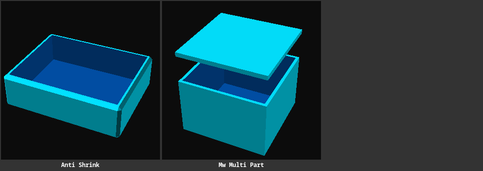
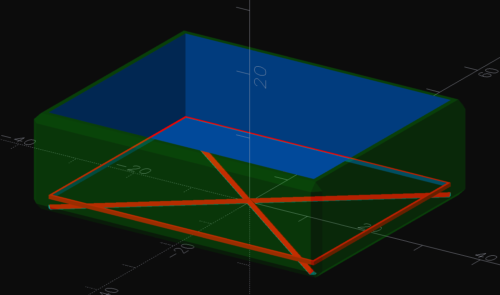
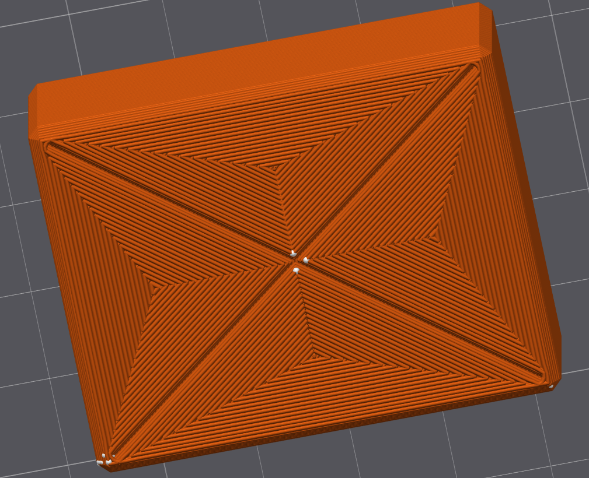

# Examples <!-- omit from toc -->

> Small, reusable OpenSCAD reference designs and example files that sit outside the main model catalog.

**Contents**

- [What's here?](#whats-here)
- [Chamfered Box with Anti-Shrink Grooves](#chamfered-box-with-anti-shrink-grooves)
- [MakerWorld multi-plate template](#makerworld-multi-plate-template)

## What's here?

- [anti-shrink.scad](./anti-shrink.scad) - A parametric hollow box with chamfered edges and shrinkage-relief grooves, designed to reduce warping or contraction in larger prints.
- [mw-multi-part.md](./mw-multi-part.md) - Notes and requirements for MakerWorld multi-plate validation, module naming, and plate layout conventions.

    - [mw-multi-part.scad](./mw-multi-part.scad) - A template for MakerWorld multi-plate `.scad` files, with separate assembly and print-plate modules.

## Chamfered Box with Anti-Shrink Grooves

This example is a simple open-top container with:

- adjustable width, length, height, wall thickness, and bottom thickness
- chamfered outside corners
- internal relief grooves to reduce stress and shrinkage in the shell
- a preview mode that keeps the geometry light while rendering in OpenSCAD

> 

It is useful as a compact example of combining BOSL2 primitives, subtraction, and parametric part tuning.

> 

## MakerWorld multi-plate template

The `mw-multi-part.scad` file demonstrates the static module convention MakerWorld expects:

- `mw_plate_1()` must not be empty
- plates must be declared explicitly as `mw_plate_1()`, `mw_plate_2()`, etc.
- the main assembly view should remain separate from the print-oriented plate modules
- individual plates should be arranged flat on the Z=0 print plane

See [mw-multi-part.md](./mw-multi-part.md) for the surrounding guidance and references.
