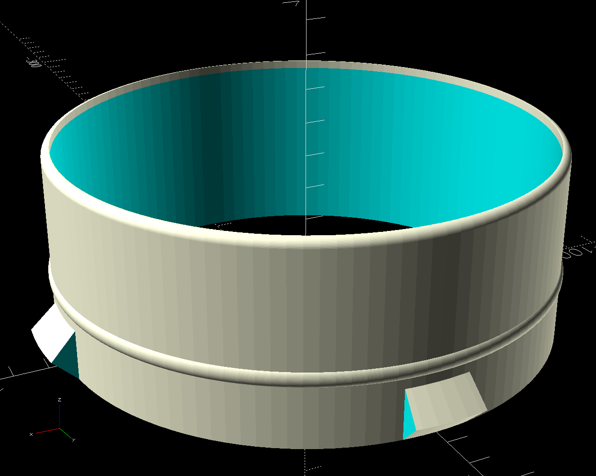
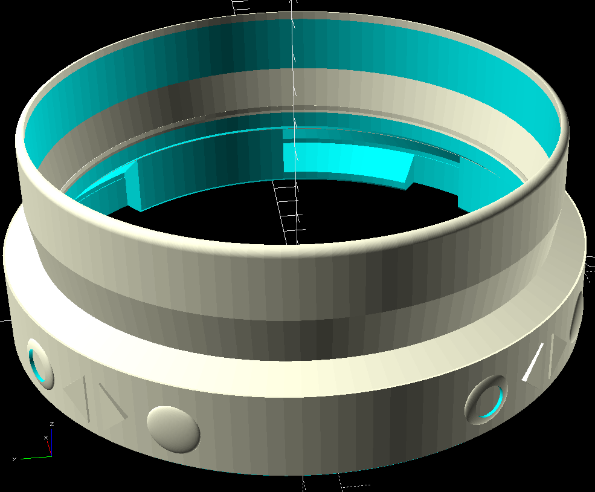

# AC Hose Bayonet Quick Couplings

These parts allow you to attach AC hoses securely to each other
and to connectors on an AC device or window adapter. They use a bayonet mechanism for quick release and easy reattachment.
The hoses are attached to the adapters by using a clamp.

> 💡 See my [Air Conditioning Collection on MakerWorld](https://makerworld.com/en/collections/33754690-air-conditioning) for related models.

**Interactive 3D Previews:**

- [Male hose connector](./hose-connector-male.stl) (STL file)
- [Female hose connector](./hose-connector-female.stl) (STL file)
- [Female adapter](./hose-connector-adapter-H45.stl) (STL file)

You can create your own customized versions using the OpenSCAD files in the
**[Parametric Model Maker](https://makerworld.com/en/makerlab/parametricModelMaker?pageType=generator)**.

The male lugs have holes in them to add inner walls for more strength.
They are chamfered on top so the female slots don't need supports.

> 

The female side has L-shaped slots the male lugs lock into.

> 

To add the bayonet connector to a plain tube you have, use this adapter.
The female model has a `tube extension` switch to enable this modified geometry.

> 
