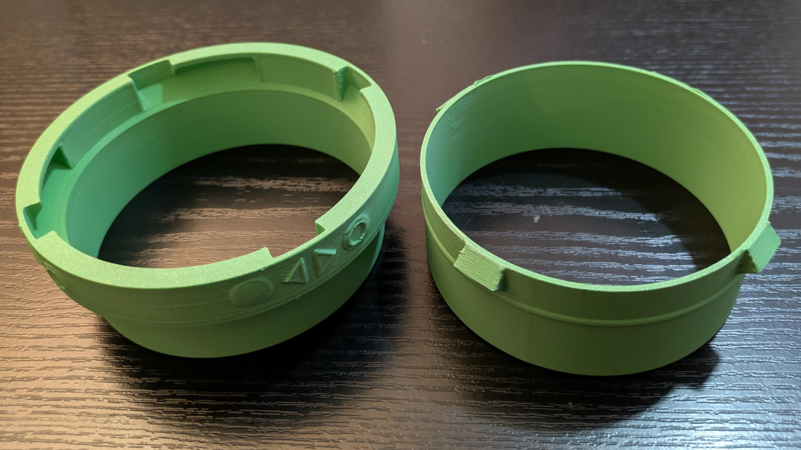
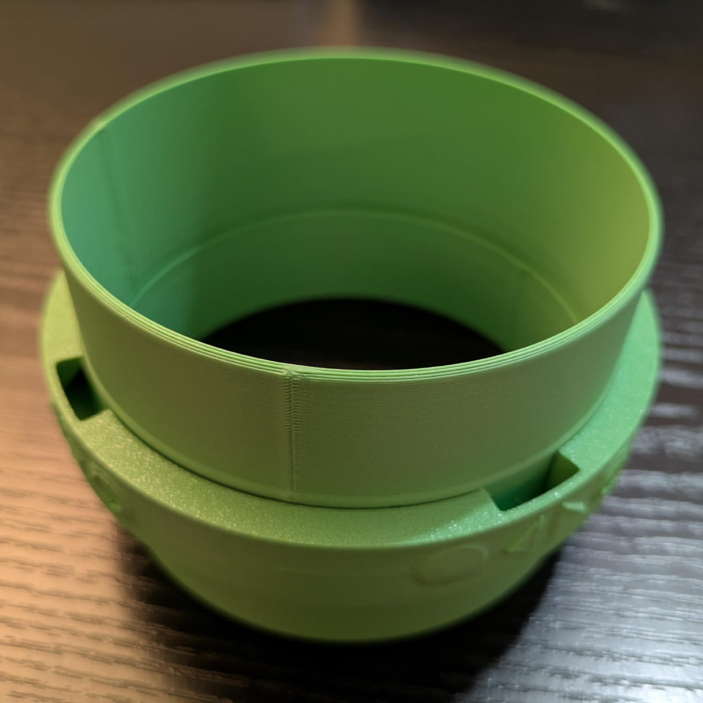
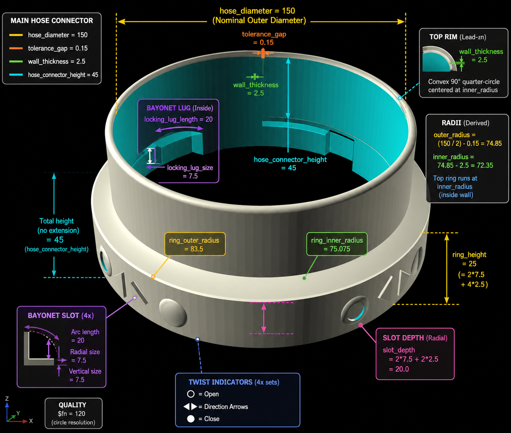

# AC Hose Bayonet Quick Connectors

These parts allow you to attach AC hoses securely to each other
and to connectors on an AC device or window adapter. They use a bayonet mechanism for quick release and easy reattachment.
The hoses are fixed to the connectors by using a clamp.

> ⚠️ **Filament Selection**  Do **NOT** use PLA for your prints, you need a heat-resistant and UV-stable material like PCTG or PETG.

All models are designed to print without any supports, on a modern device that supports 45° overhangs.

> 💡 See my [Air Conditioning Collection on MakerWorld](https://makerworld.com/en/collections/33754690-air-conditioning) for related models.

**Interactive 3D Previews:**

- [Male hose connector](./hose-connector-male.stl) (STL file)
- [Female hose connector](./hose-connector-female.stl) (STL file)
- [Female adapter](./hose-connector-adapter-H45.stl) (STL file)

You can create your own customized versions using
the [SCAD](https://www.youtube.com/watch?v=R6Xqeg6Q93k) files
in the **[Parametric Model Maker][female-connector-model-maker]**
or your local [OpenSCAD](https://openscad.org/downloads.html) installation (and you want the *Nightly Builds* version).

> [][female-connector-model-maker]

The male connector has lugs that go into slots of the female one.

> 

The female side has L-shaped slots the male lugs lock into.

> 

To add the bayonet connector to a plain tube you already have, use this adapter.
The female model has a `tube extension` switch to enable this modified geometry.

> 

[female-connector-model-maker]: https://makerworld.com/en/makerlab/parametricModelMaker?designId=3220030&from=model_page&modelName=hose-connector-female.scad&scadUrl=https%3A%2F%2Fraw.githubusercontent.com%2Fjhermann%2Fthings%2Frefs%2Fheads%2Fmain%2Fmodels%2Fac-bayonet-connectors%2Fhose-connector-female.scad&unikey=f5a0b360-ef3e-4e34-942e-b1f3741da9e8
