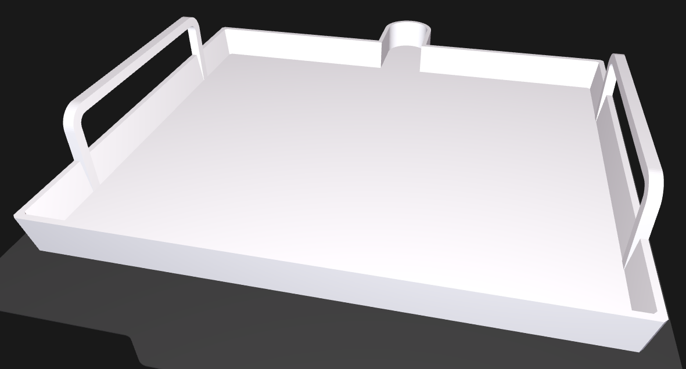
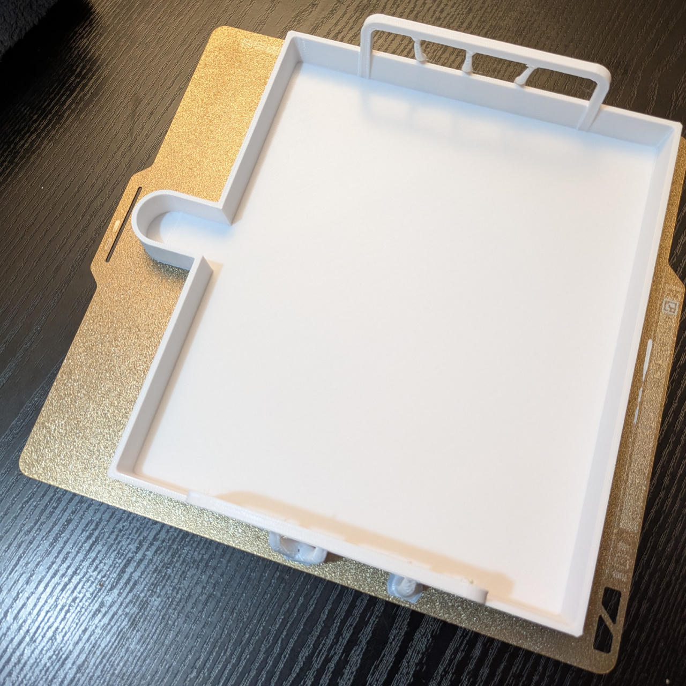
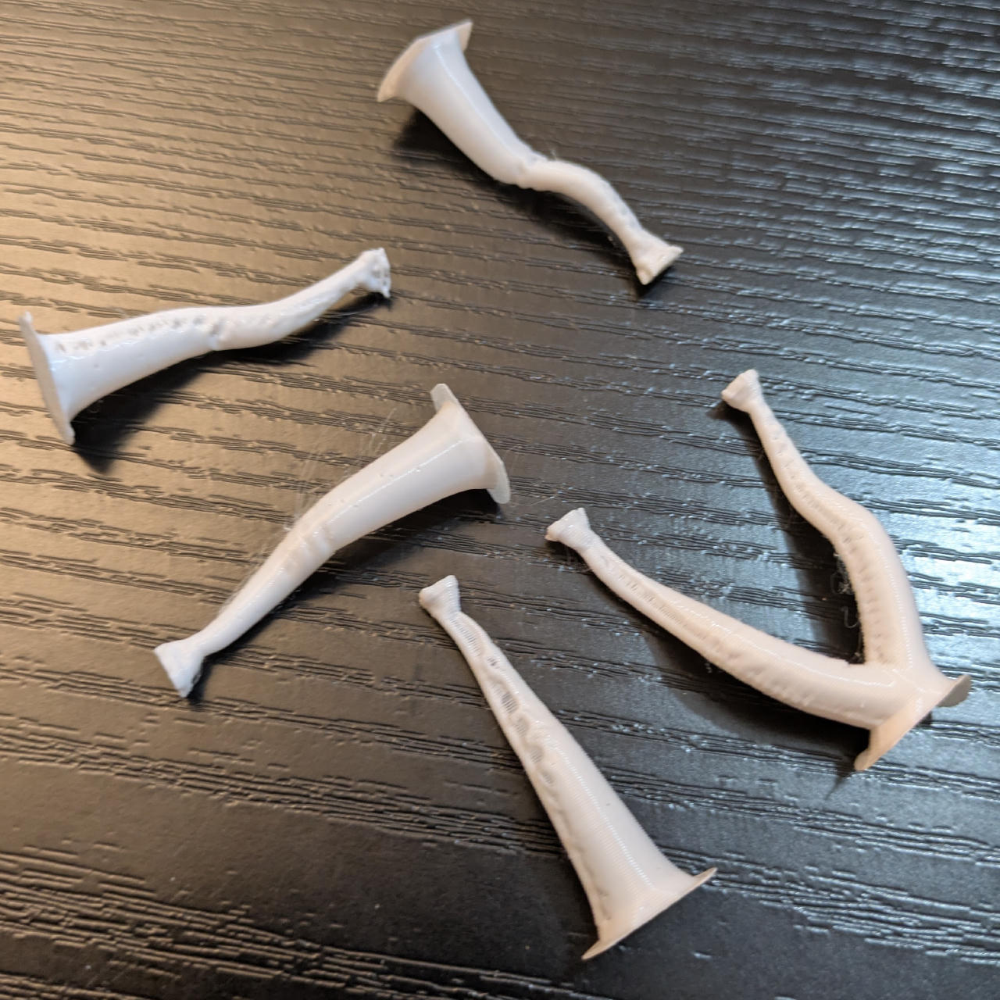

# AC Drain Pan

A parametric model that you can use to drain your AC's condensate
before you transport it or putting it away at the end of season.

The example model with default measurements holds ~680ml to the rim,
but in practice that'll be about 400ml when you don't want to spill.
It fits on a *Bambu Lab A1* plate.

The default model works with many common AC mono-block devices, e.g.
*Comfee PH1-08CRN1* (8000 BTU/h) and *MPPH-09CRN7* (9000 BTU/h),
or the *Olimpia Splendid 01913 Dolceclima Compact 8P* (8000 BTU/h).

The most important measurement here is the height of the pan and spout, which has to fit under the lower drain.
You can print a test cuboid with several candidate dimensions to get an exact fit.
I printed one sized 19×20×21 mm and wrote the sizes on the related side walls.

See the [Parametric AC Hose Connectors (Intake / Exhaust)](https://makerworld.com/en/models/3201549-parametric-ac-hose-connectors-intake-exhaust) model for more AC accessories.

> 
> 
> 

## How It's Made

- [MakerWorld's Parametric Model Maker](https://makerworld.com/en/makerlab/parametricModelMaker)
was used, with the "Creator Portal" button on top.
- [Create customizable models on Maker World using Parametric Model Maker](https://forum.bambulab.com/t/create-customizable-models-on-maker-world-using-parametric-model-maker/156334) (forum post)
- ▶️ [Cool new MakerWorld feature](https://www.youtube.com/watch?v=tTxtUKSM08c)

AI instructions:

- Create a parametric OpenSCAD file.
- Use the `.scad` extension for the generated file.
- The basic shape is a box, with angled walls.
- Chamfer all the outer edges of the box.
- The walls with length `depth` are the left/right ones.
- The walls with length `width` are the front/back ones.

- On each of the left/right walls, there is a handle to pick up the box.
- The handle is u-shaped resulting from extruding half a rounded rect.
- The handle is placed vertically on top of the wall (opening of the U / ends of teh handle points downwards).
- The outside of the handle is flush with the walls outer edge, then extending into the room above the box.
- To better connect the handle with the inside wall, extend the end faces of the handle downwards to form rectangular pillars, down to the box bottom of the box, then clip them with the box shape.
- The handle edges are chamfered.

- The backside wall has a spout formed as a rectangular channel, open on top and towards the inside of the box.
- The spout is centered in the back wall.
- The spout is as high as the box.
- The spout ends in a hollow half-cylinder; looked at from above, the spout's rim is formed like an U, with the opening pointing to the box.
- The spout is connected to and penetrates the angled backside wall. Extend the spount's channel as needed, clipped by the box's inner empty space.
- The spout's upper rim has to be flush with the upper rim of the box.

Parameters:

- wall thickness 2.5mm
- chamfer size 1.5mm
- box height 19mm
- box width (top) 240mm
- box depth (top) 200mm
- box wall angle 82°
- spout width 30mm
- spout length 25mm
- handle length 120mm
- handle width 5mm
- handle height 25mm
- handle radius 10mm

Plus a little back & forth to get rid of the AIs spatial errors (they all suck at geometry).
