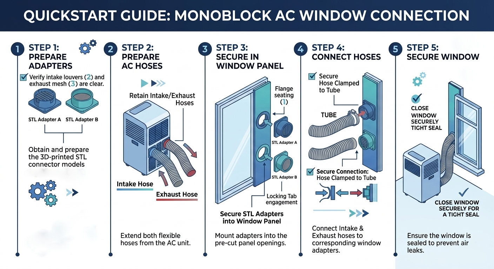

# AC Hose Connectors (Intake / Exhaust)

These are parts that allow you to connect AC hoses to a window or door panel
with holes cut into it.

Interactive 3D Previews:

- [Exhaust hose connector](./hose-connector-generic.stl) (STL file)
- [Exhaust cover with delflection grill](./vent-cover-grill.stl) (STL file)
- [Intake hose connector with insect screen](./hose-connector-intake.stl) (STL file)

The *exhaust & intake hose connectors* are inserted into 150mm holes (or 180/200mm for the intake if you choose to),
from the side of the panel that ends up outside.

Then the hoses and the connectors are secured in place
by clamping each hose to its connector. The exhaust goes to the upper hole so you do not get a thermal short circuit.

Finally, use the *exhaust cover* to direct the warm air away from the intake (usually upwards to the right or left).
