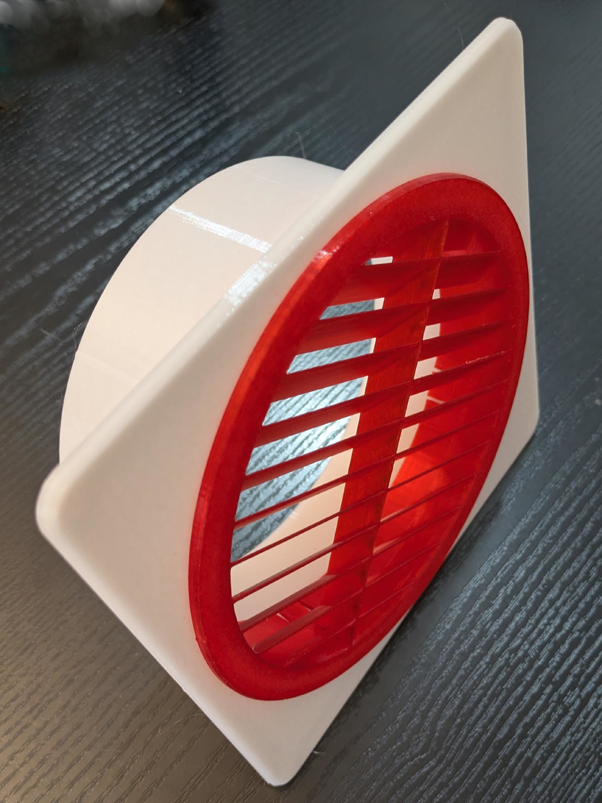
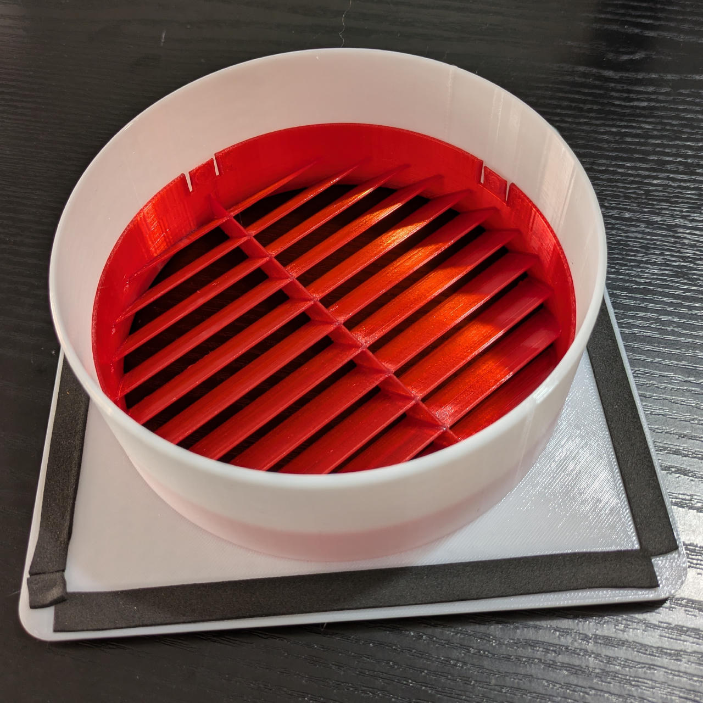
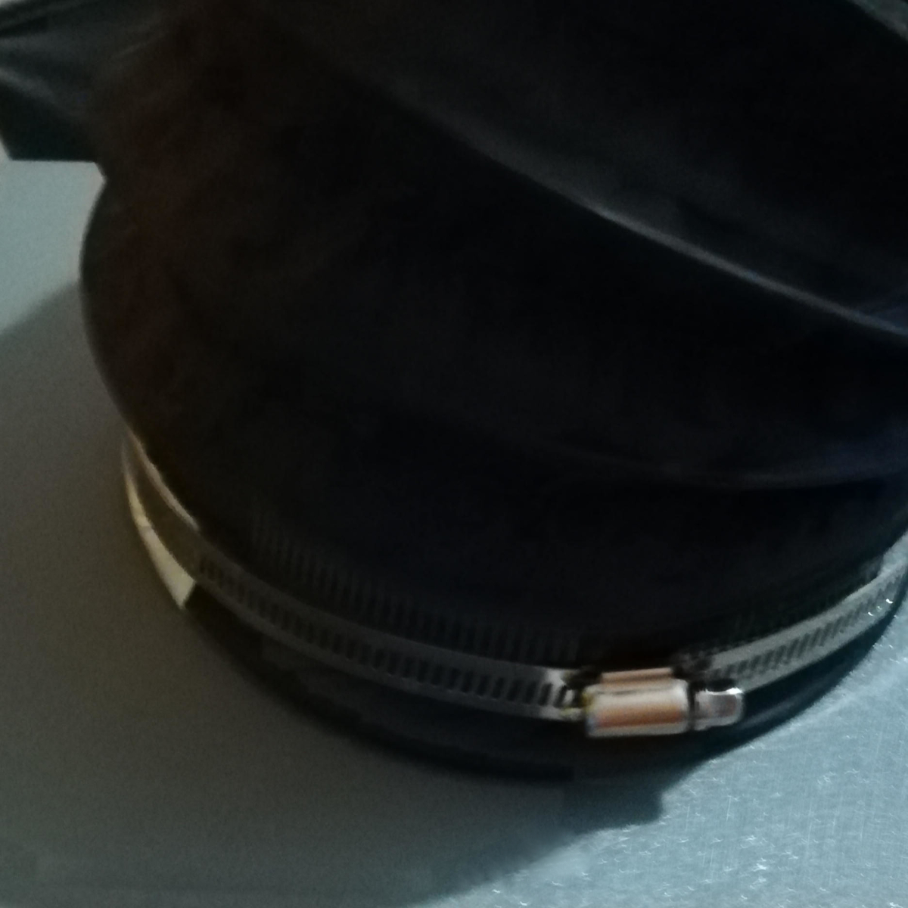

# Parametric AC Hose Connectors (Intake / Exhaust)

This model is one of two parametric parts, a hose connector
and a deflecting grill that can be rotated in the exhaust connector
to direct the hot air away from a nearby intake.

You can add a 2nd 150mm intake hose easily, or print a connector for an intake hose of up to 200mm (this still fits on an A1 plate).

**Features:**

- Connector for any hose size within build space limits, with an optional insect grill.
- An optional groove in the base plate for applying insulating foam tape.
- Grill with deflector fins for directing exhaust air.
- Pretty much all dimensions are parametric.

**Model pages:**

- [Parametric AC Hose Connectors (Intake / Exhaust)](https://makerworld.com/en/models/3201549-parametric-ac-hose-connectors-intake-exhaust)
- [Parametric AC Deflecting Grill](https://makerworld.com/en/models/3201677-parametric-ac-deflecting-grill)

A solution with two hoses needs the connector with grill for the intake,
an open exhaust connector (with a grill height of zero),
and the deflecting cover.

See also the [Parametric AC Hose Adapter Plate](https://makerworld.com/en/models/3002030-parametric-ac-hose-adapter-plate-adjustable) and [AC Intake Cover - Side Extension Box](https://makerworld.com/en/models/3148775-ac-intake-cover-side-extension-box) models for a solution on the device's end.

> 💡 See my [Air Conditioning Collection on MakerWorld](https://makerworld.com/en/collections/33754690-air-conditioning) for more related models.

## Assembly

⚠️ Do **NOT** use PLA for your prints, you need a heat-resistant and UV-stable material like PCTG or PETG.

What you need:

- Printed intake connector (with insect screen).
- Printed exhaust connector (no insect screen).
- Rotating exhaust grill.
- Some kind of panel (polycarbonate twin-wall sheet, HPL compact panel, ...) with holes of the hose diameter, that you insert into the window.
- *Optional:* self-adhesive foam tape (1mm thick, 10mm wide).
- Hoses with clamps for attaching the hoses and keeping the connectors in place.

As designed, you insert the connectors *from the outside* into the holes in your panel, and then attach the hoses using a clamp, securing both the hose and connector in place. You can also fix it to the window panel by using the optional M4 screw holes (and consider using a washer).

Use the *exhaust cover* to direct the warm air away from the intake (usually upwards to the right or left).

Also see the [things/models/ac-hose-connector-intake](https://github.com/jhermann/things/tree/main/models/ac-hose-connector-intake#readme) folder on GitHub for STL files created with the default parameters, and the OpenSCAD files.

----
Copyright 2026 Jürgen Hermann •
Licensed under [CC BY-NC 4.0](https://creativecommons.org/licenses/by-nc/4.0/deed.en).

 