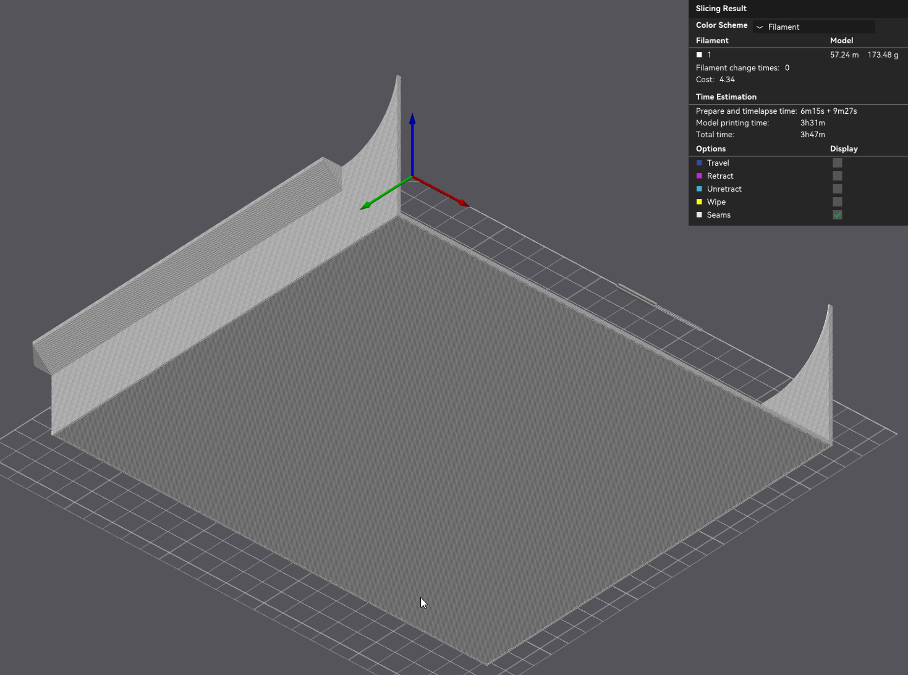

# AC Side Extension Box

This complements an intake AC adapter as created by the
[Parametric AC Hose Adapter Plate](https://makerworld.com/en/models/3002030-parametric-ac-hose-adapter-plate-adjustable)
model. 

> 

You have to extend that model's width so that it also covers the smaller opening of this side extension
(depth + arc radius of this model, and using the same height and wall thickness).

The resulting model can be printed without supports, when not changing the "support angle" too much,
and when the large side wall is placed on the print bed.

When your dimensions go beyond the build volume of your printer,
in your slicer cut the model vertically into two or four pieces.
The provided defaults fit on a Bambu Lab A1 plate.

Use a
[radius gauge](https://makerworld.com/en/models/1508623-radius-gauge-radgauge-mega)
to measure the corner radius of your device, so you can set "arc radius" accordingly.

If you device's surface is curved beyond a simple round corner, just apply more duct tape. 😃

## How It's Made

- [MakerWorld's Parametric Model Maker](https://makerworld.com/en/makerlab/parametricModelMaker)
was used, with the "Creator Portal" button on top.
- ▶️ [Cool new MakerWorld feature](https://www.youtube.com/watch?v=tTxtUKSM08c)

AI instructions:

- Create a parametric SCAD file that can be used on MakerWorld's *Parametric Model Maker*.
The basic shape is a box, but with 2 sides open (no walls).
One of them has the height x depth dimensions, 
the other the height x width ones.

- There are two additional elements, comprised of a square
with the same wall thickness, where a part of it is removed
by one fourth of a cirle with a given arc radius, and the same
radius is used as the size of the square.

- Place that square, which later covers a rounded corner with
the arc radius, on the top and bottom walls, positioned on
the corners where the missing walls meet (effectively adding
a piece to the top and bottom walls).

- These square corner pieces have to stick out of the bounding box of the basic shape.
Orient them so they connect with one of their wall edges to the top and bottom walls.

- Use the `.scad` extension for the generated file.

The initial parameters were:

- height
- width
- depth
- wall thickness
- arc radius

Then a long interactive optimization session created the
[Side-Extension-Box.scad](./Side-Extension-Box.scad) file.
