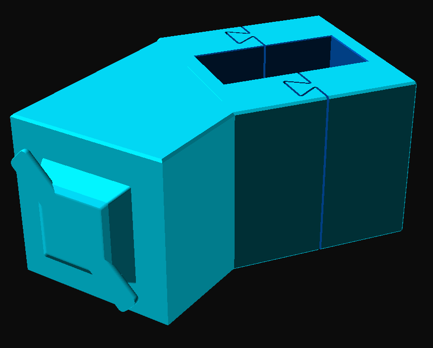
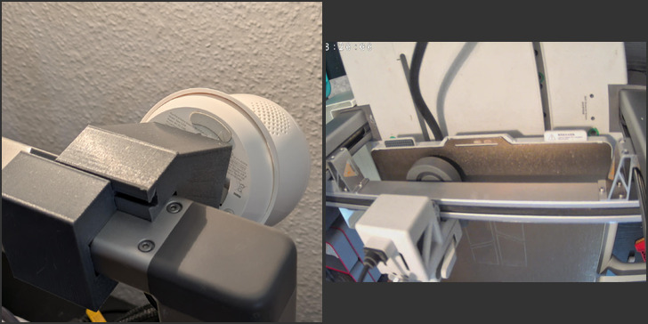
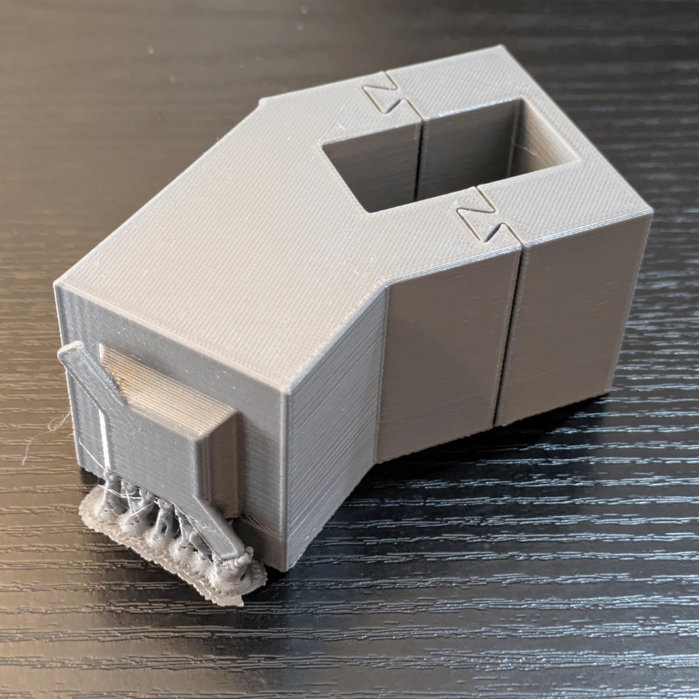

# BambuLab A1 Gantry Mount

A parametric model for mounting something on the gantry connecting the A1 Z screws.

> 

## 3D Files

- [gantry-mount.scad](./gantry-mount.scad) - Parametric OpenSCAD source.
- [gantry-mount.3mf](./gantry-mount.3mf) - Ready-to-slice model.

## Plate 2: Tapo C230 Camera Mount

The second plate combines the A1 gantry bracket with a twist-lock holder
for the [TP-Link Tapo C230 camera][mw-tapo-c230-wall-mount]. It uses the
same camera interface as the standalone wall mount, but replaces the wall
plate with a mount for the A1 gantry.

The holder dimensions and the bracket dimensions are parameters in
[gantry-mount.scad](./gantry-mount.scad), so the model can
be adjusted for fit before slicing.

Steps to mount the camera on the *right* side of the gantry:

1. Twist-lock the camera to the back piece of the bracket.
2. Slide that piece of the bracket onto the backside of the gantry, camera pointing down.
3. Check that the bracket is on the very right side of the gantry.
4. Make sure the camera power cable position is convenient (points to the right, away from the bed).
5. Slide on the smaller piece of the bracket, left of the other piece.
6. Apply gentle pressure directed to the back and the right, to slide the front piece into the dovetail grooves.
7. ⚠️ Leave 2cm of clearance to the end of the gantry, so the part connecting the toolhead rail to the Z screw has enough space.
8. Try it out, pan & tilt for a full view of the print bed.

> 

| | |
|---|---|
|⚠️ | Make sure that a model you plan to print is not full-height in the back-right quadrant of the print plate, otherwise the camera might collide with it. If in doubt, remove the camera. However, my measurements with a Tapo C230 indicate a clearance of 32cm, so this might be overly cautious. |
| | |

> 
>
> *Printed Mounting Bracket*

[mw-tapo-c230-wall-mount]: https://makerworld.com/en/models/3321183-tapo-c230-c2xx-camera-wall-mount

## Recommended Print Settings

These are already set in [gantry-mount.3mf](./gantry-mount.3mf).

1. Quality > Wall generator: Arachne
2. Strength > Sparse infill pattern: Gyroid
3. Support > Enable support: ✅
4. Support > Type: tree(auto)
