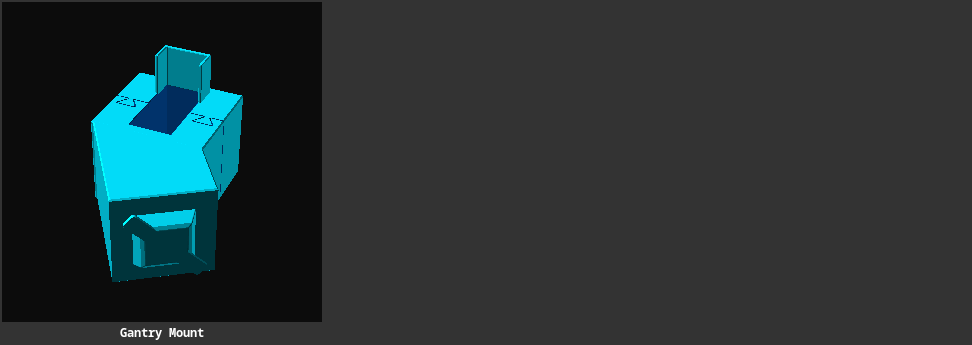

# BambuLab A1 Traversal Mount

A parametric model for mounting something on the traversal connecting the A1 Z screws.

> 

## 3D Files

- [upper-traversal-mount.scad](./upper-traversal-mount.scad) - Parametric OpenSCAD source.
- [upper-traversal-mount.3mf](./upper-traversal-mount.3mf) - Ready-to-slice model.

## Plate 2: Tapo C230 Camera Mount

The second plate combines the A1 traversal bracket with a twist-lock holder
for the [TP-Link Tapo C230 camera][mw-tapo-c230-wall-mount]. It uses the
same camera interface as the standalone wall mount, but replaces the wall
plate with a mount for the A1 traversal.

The holder dimensions and the bracket dimensions are parameters in
[upper-traversal-mount.scad](./upper-traversal-mount.scad), so the model can
be adjusted for fit before slicing.

Steps to mount the camera on the *right* side of the traversal:

1. Twist-lock the camera to the back piece of the bracket.
2. Slide that piece of the bracket onto the backside of the traversal, camera pointing down.
3. Check that the bracket is on the very right side of the traversal.
4. Make sure the camera power cable position is convenient (points to the right, away from the bed).
5. Slide on the smaller piece of the bracket, left of the other piece.
6. Apply gentle pressure directed to the back and the right, to slide the front piece into the dovetail grooves.
7. Try it out, pan & tilt for a full view of the print bed.

| | |
|---|---|
|⚠️ | Make sure that a model you plan to print is not full-height in the back-right quadrant of the print plate, otherwise the camera might collide with it. If in doubt, remove the camera. |
| | |

> 
>
> *Printed Mounting Bracket*

[mw-tapo-c230-wall-mount]: https://makerworld.com/en/models/3321183-tapo-c230-c2xx-camera-wall-mount
