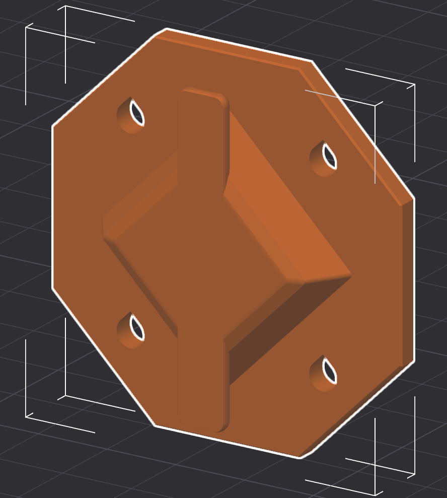
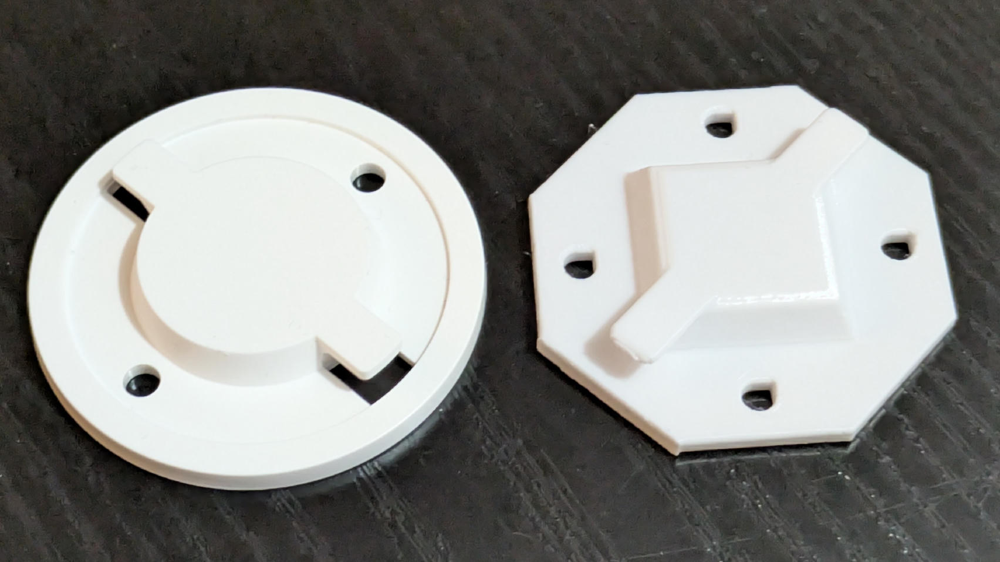

# Tapo C230 Camera Wall Mount

A parametric model for mounting a TP-Link Tapo C230 camera on a wall. The wall mount uses a twist-lock bar and a plate with four mounting holes.

> 

The wall mount has a 55 mm octagonal mounting plate with 4 mm holes on a 28 mm square pattern.

> 
>
> *Printed Wall Mount vs. Original (on the left)*

It is designed to be printed as supplied in the 3MF file, with outer brim and tree support active.

## 3D Files

- [wall-mount.scad](./wall-mount.scad) - Parametric OpenSCAD source for the camera wall mount.
- [wall-mount.3mf](./wall-mount.3mf) - Ready-to-slice model.

You can customize the wall mount using the [OpenSCAD](https://openscad.org/downloads.html)
app or the [MakerWorld Parametric Model Maker](https://makerworld.com/en/makerlab/parametricModelMaker). This might make it possible to use this for other cameras where the default mount doesn't fit.

The main parameters are the plate diameter, twist-lock bar dimensions, wall thickness, and mounting-hole spacing.

> 💡 The SCAD file can also be integrated into models for mounting the camera to other things.
