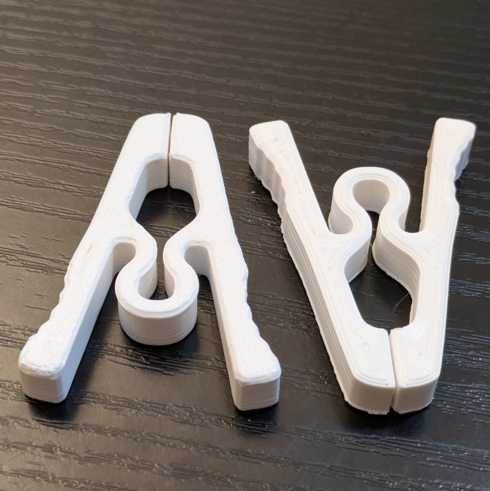
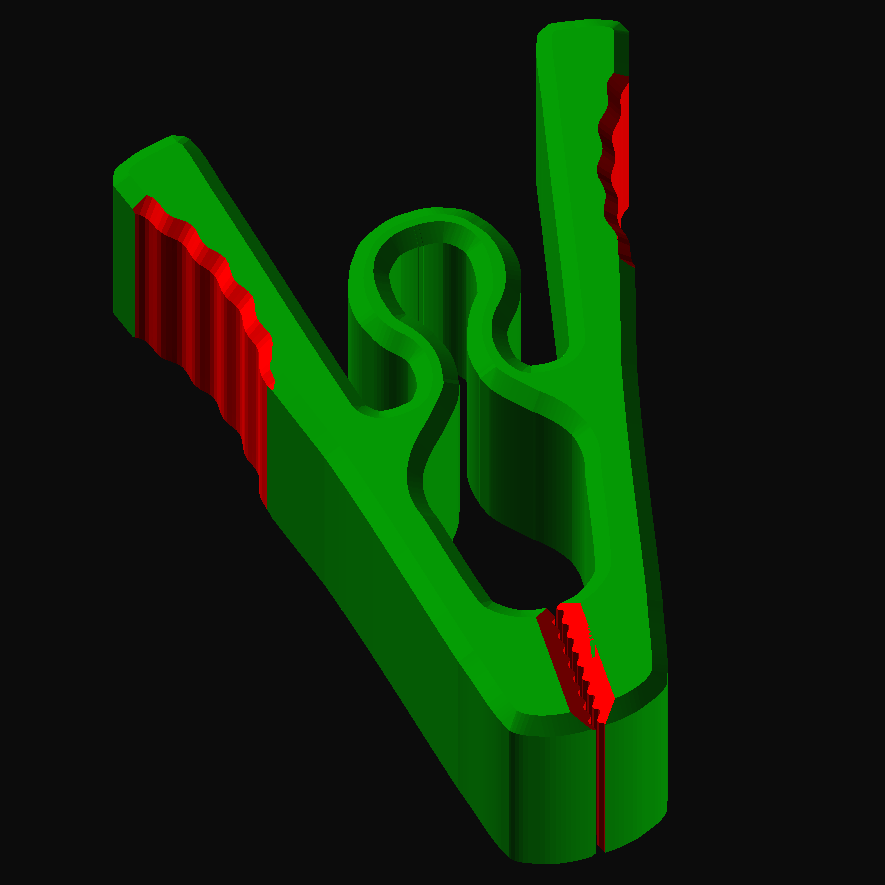

# Clothes Pin

A single-piece, spring-free clothespin. There's no metal spring or second
part to assemble: the pin's own coiled profile flexes at the pivot to hold
the jaws closed, nothing is cut there to make it work.

> 

## Design

- The side profile (jaws, pivot loop, and grip lobes) is traced from
  [Clothes-Pin.svg](./Clothes-Pin.svg), which holds one symmetric half; it
  is mirrored to build the full outline, then linear-extruded and
  minkowski-summed with a small diamond to chamfer the top/bottom edges.
- The clamping jaws, at the front, are tapered top and bottom, and their
  gap is cut with a wavy `wave_ribs` rift (`rift_cutter`, sized by
  `pin_gap`) so the two jaw halves interlock instead of meeting in a
  straight line, for a better grip on fabric.
- The finger-press ends, at the back on both sides, get a `wave_ribs`
  texture cut into them (`grip_cutter`) as a thumb grip.
- Prints in one piece, in place, with no assembly or added spring.

> 

It is based on the 2D cross-section from [this model](https://makerworld.com/en/models/843346-simple-clothespin-fully-3d-printed), but otherwise fully redesigned in OpenSCAD with chamfering of edges (also preventing the fusing of the grip jaws) and wavy grip elements, avoiding any sharp edges.

## Parameters

- `pin_depth` - front-to-back thickness of the pin (the profile's
  extrusion length), 10-40 mm.
- `pin_width` - width of the pin's profile, 10-40 mm.
- `pin_gap` - width of the wavy gap cut between the jaw halves at the
  clamping end so they interlock, 0.2-1 mm.

## 3D Files

- [pin.scad](./pin.scad) - Parametric OpenSCAD source.
- [Clothes-Pin.3mf](./Clothes-Pin.3mf) - Ready-to-slice model.
