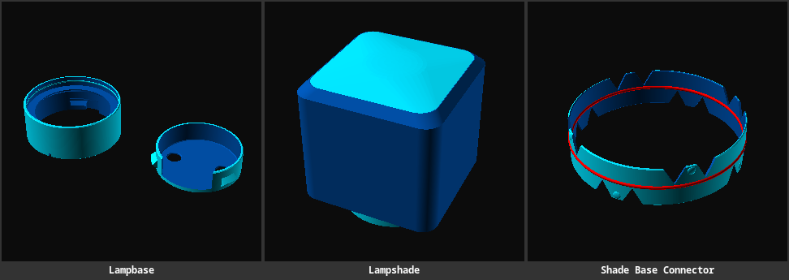
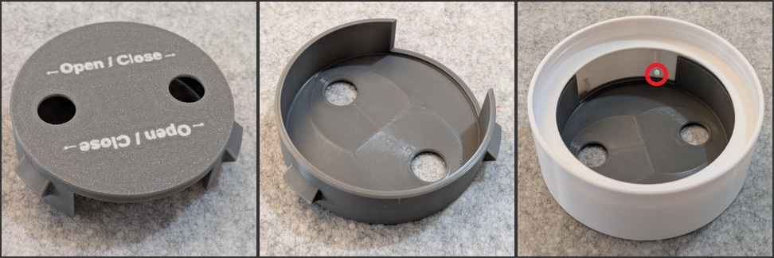
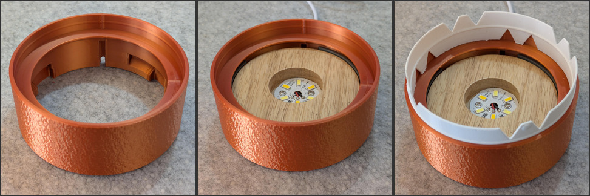
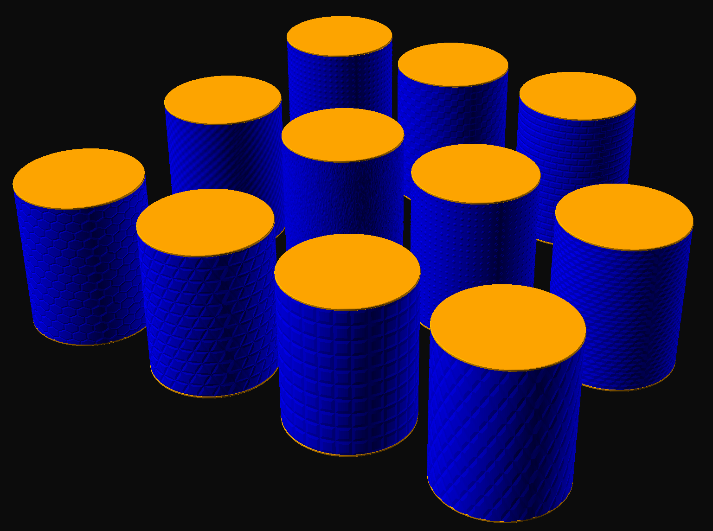

# Lamp Base for a LED Puck

All models are designed to print without any supports, on a modern device that supports 45° overhangs.

LED Puck:

- https://www.amazon.de/dp/B09YRN43F5)
- Outer dimensions 82×21mm, inner ⌀32mm; 100g
- The top of the cable sits at 1.2mm; cable ⌀3mm

You can create your own customized versions using the [SCAD](https://www.youtube.com/watch?v=R6Xqeg6Q93k) files
in the **[Parametric Model Maker][lampbase-model-maker]**
or your local [OpenSCAD](https://openscad.org/downloads.html) installation (and you want the *Nightly Builds* version).

> 

Note that [lampbase.scad](./lampbase.scad) is a script enabled for MakerWorld's multi-plate feature, and your download will always be a 3MF with all objects on their own plate.

## OpenSCAD files

- [lampbase.scad](./lampbase.scad) - Main lamp base and shade assembly, including the MakerWorld multi-plate definitions. [🧊✏️][lampbase-model-maker]        
- [shades/round-textured.scad](./shades/round-textured.scad) - Cylindrical lamp shade with selectable texture choices.   

  You can select these textures in the customizer by their index:
	- 0: hex grid
	- 1: tri grid
	- 2: truncated pyramids
	- 3: truncated diamonds
	- 4: hills
	- 5: rough
	- 6: dots
	- 7: cubes
	- 8: cones
	- 9: checkers
	- 10: bricks
- [shade-base-connector.scad](./shade-base-connector.scad) - Friction-fit connector joining the lamp base and shade. [🧊✏️][shade-base-connector-model-maker]

[lampbase-model-maker]: https://makerworld.com/en/makerlab/parametricModelMaker?from=model_page&modelName=lampbase.scad&scadUrl=https%3A%2F%2Fraw.githubusercontent.com%2Fjhermann%2Fthings%2Frefs%2Fheads%2Fmain%2Fmodels%2Flamp-led-puck%2Flampbase.scad
[lampshade-model-maker]: https://makerworld.com/en/makerlab/parametricModelMaker?from=model_page&modelName=lampshade.scad&scadUrl=https%3A%2F%2Fraw.githubusercontent.com%2Fjhermann%2Fthings%2Frefs%2Fheads%2Fmain%2Fmodels%2Flamp-led-puck%2Flampshade.scad
[shade-base-connector-model-maker]: https://makerworld.com/en/makerlab/parametricModelMaker?from=model_page&modelName=shade-base-connector.scad&scadUrl=https%3A%2F%2Fraw.githubusercontent.com%2Fjhermann%2Fthings%2Frefs%2Fheads%2Fmain%2Fmodels%2Flamp-led-puck%2Fshade-base-connector.scad
