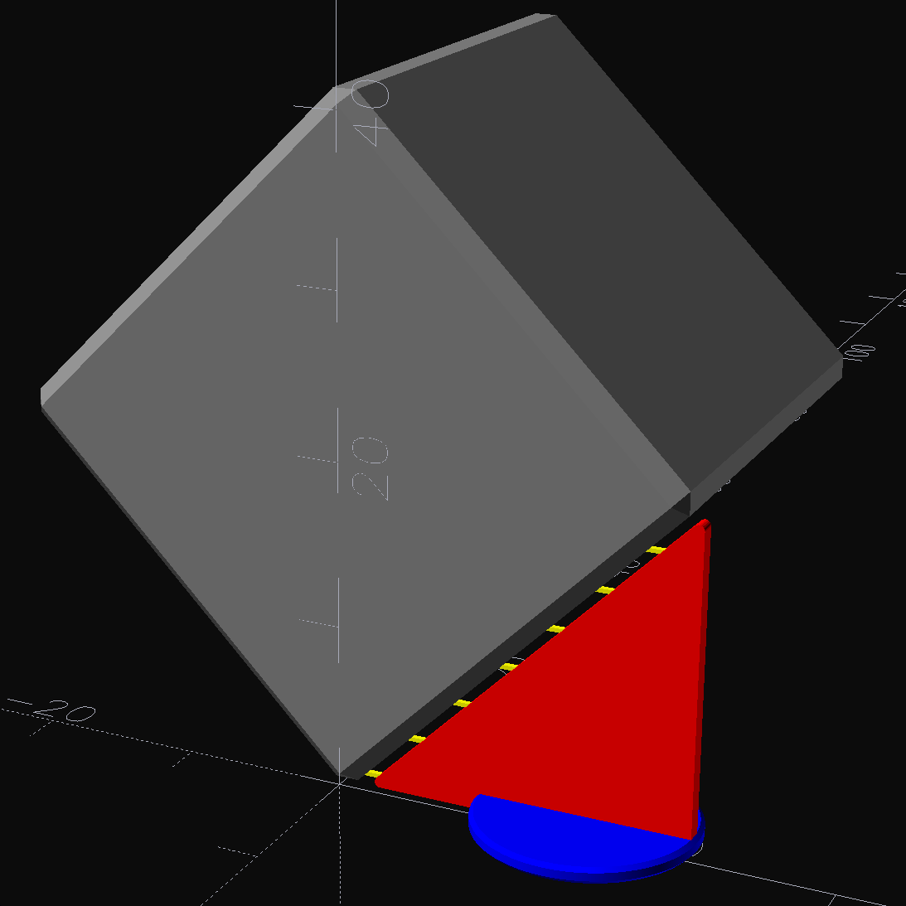
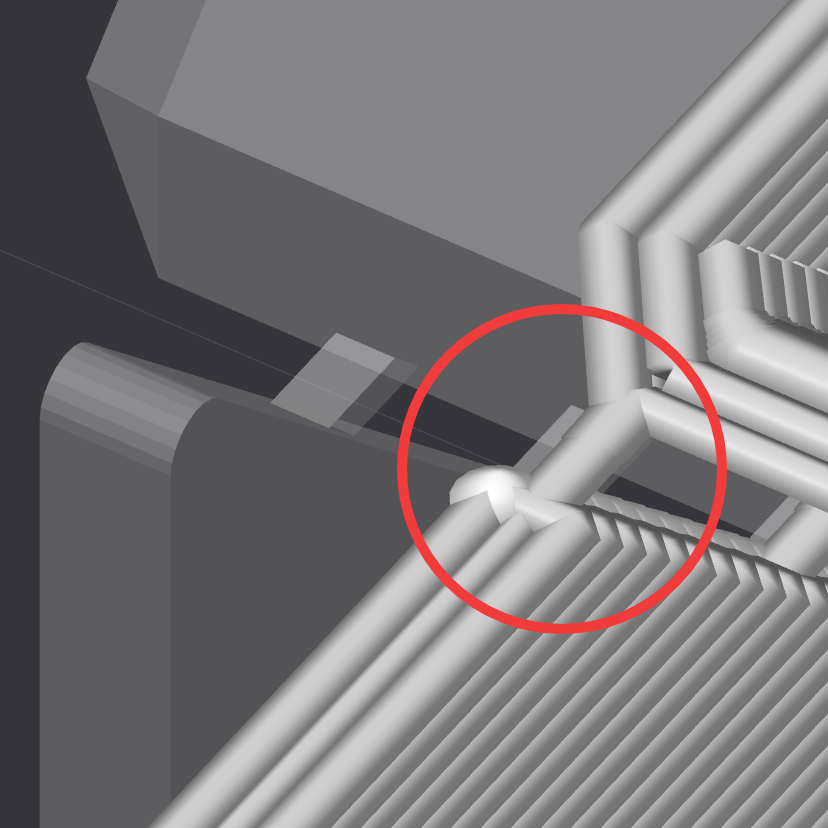
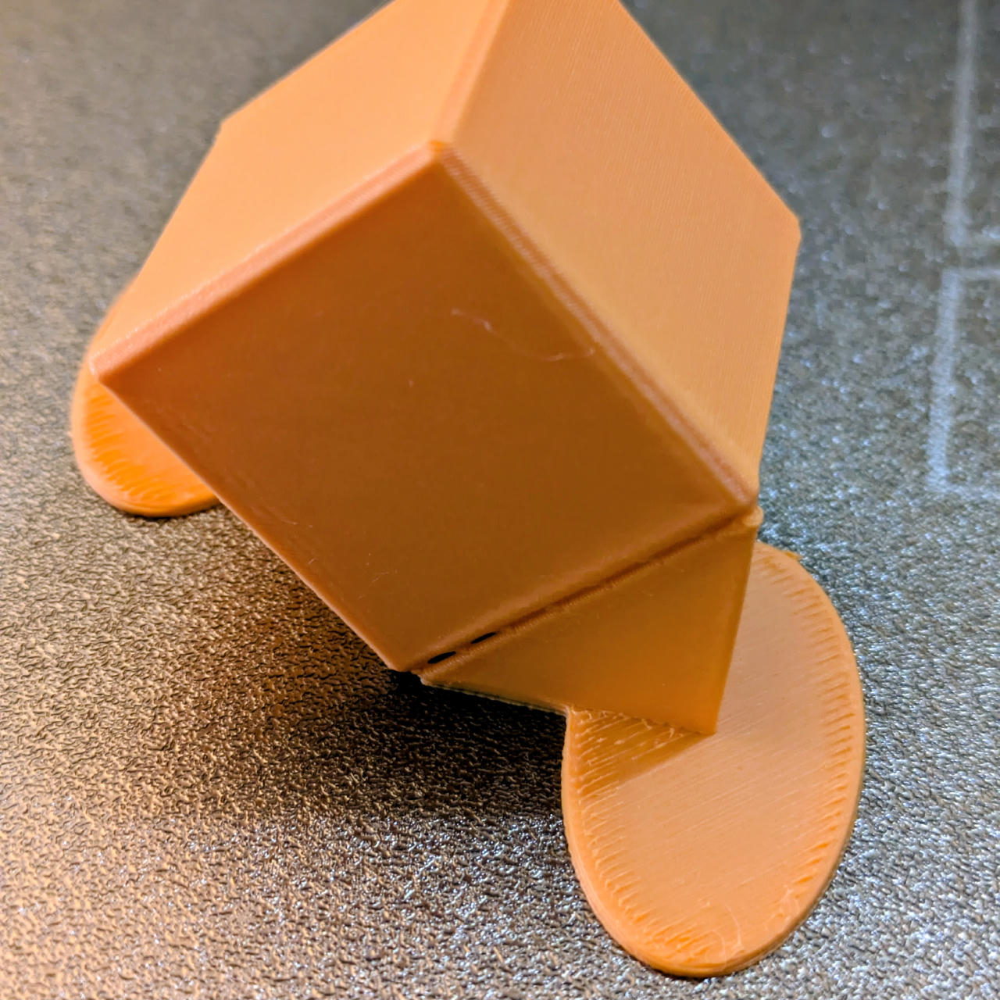
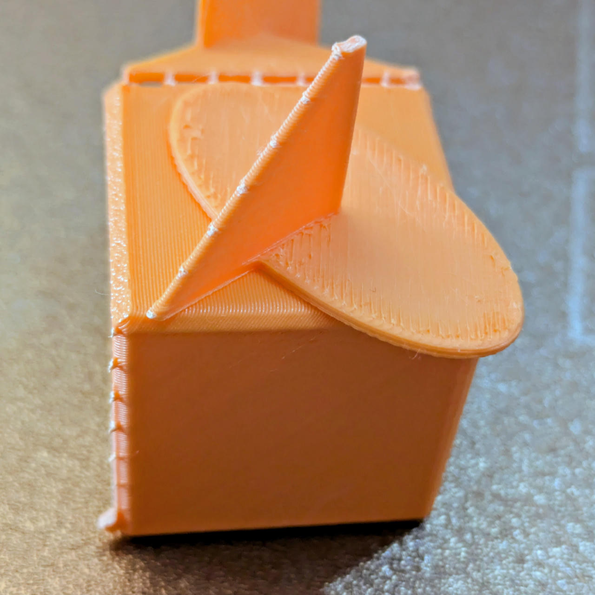

# Parts

Reusable OpenSCAD parts and helper modules for building models.

## Subtopics

- [Joining](joining/README.md) - Reusable geometries for joining printed pieces.
- [Textures](textures/README.md) - Reusable surface texture patterns and examples.

## Parts

> 

- [Disks and washers](disks-and-washers.scad) - Approximates a solid of revolution as stacked disks/washers using the disk/washer method.
- [Rounded cubes](rounded-cubes.scad) - Rounded cube primitives.
- [Shells](shells.scad) - Approximates a solid of revolution as stacked cylindrical shells using the shell method.
- [Support fin](support-fin.scad) - A parametric triangular designed supports holding up objects printed on an edge or corner.
- [Threads](threads.scad) - A flush threaded container and lid with a recessed, overlapped trapezoidal thread profile.
- [Torus](torus.scad) - A torus with independently adjustable radial and vertical radii and arc angle.

## Details

### Support Fins (Designed Support)

Parametric triangular gussets with attachment tines and a bed-adhesion helper for supporting objects printed on an edge or corner.

[OpenSCAD source](./support-fin.scad) | [STL preview](./support-fin.stl)

This allows you to have minimal bed contact of the object and is especially useful when you add surface textures via *fuzzy skin* or [BumpMesh by CNC Kitchen](https://bumpmesh.com/).

> 
>   *Preview in OpenSCAD*
>
> 
>   *Tine detail in the slicer*

Once printed, support removal is very easy because the contact area is small. And if you wiggle the support a bit, the fins typically come off very clean to start with. Use a deburring tool for the rest.

> 
>
> 

**Material Use**

- Cube: 9.98g
- 2 Supports: 1.85g (+18.5%; 15.6% of total)
- Total: 11.8g
