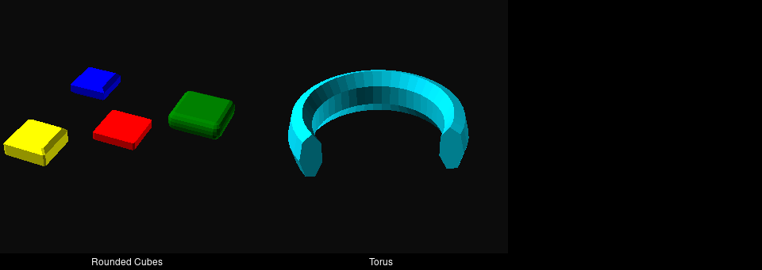

# Parts

Reusable OpenSCAD parts and helper modules for building models.

## Parts

> 

- [Rounded cubes](rounded-cubes.scad) - Rounded cube primitives.
- [Torus](torus.scad) - A torus with independently adjustable radial and vertical radii and arc angle.

## Textures

- [Textures](textures/README.md) - Reusable surface texture patterns and examples.
