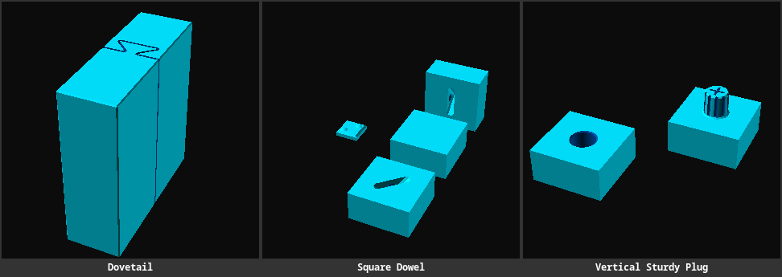
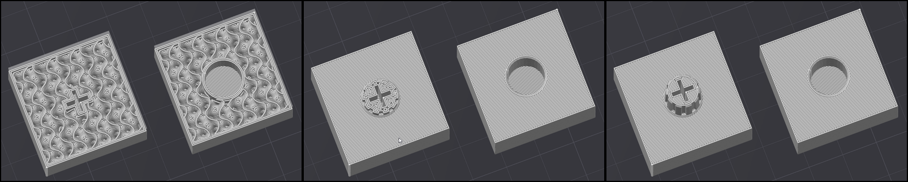
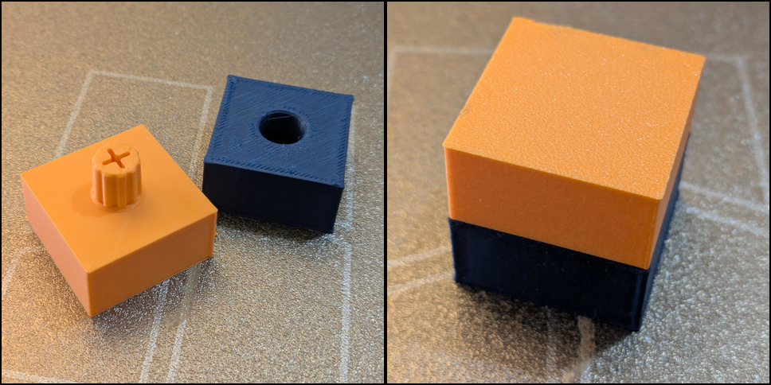
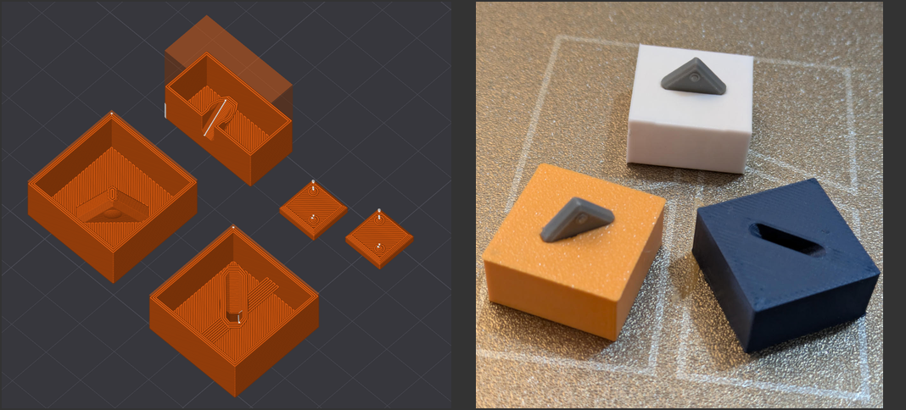
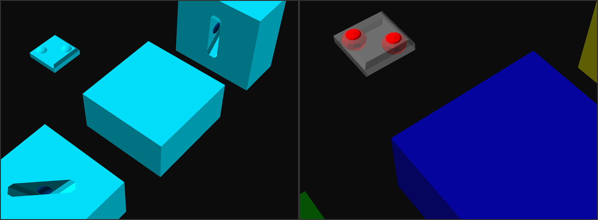

# Joining Parts

Reusable OpenSCAD geometries to join pieces together.

> 

## Vertical Sturdy Plug

[OpenSCAD source](vertical-sturdy-plug.scad) | [3MF download](vertical-sturdy-plug.3mf)

The 'sturdy' in the plug comes from several micro-features:

- the plug is rooted in the main object's infill,
- it has practically no infill itself, just many walls, caused by the ribbing and the cross-shaped cutout,
- and the bottom chamfer adds more strength at the biggest stress point.

> 

The chamfers at the tip and the hole's rim make insertion easy,
and the outer hull of the plug is slightly slanted to increase friction the deeper the plug goes in, ultimately leading to a comfortable insertion but with a snug fit.

> 
>
> *Recommended print settings: Arachne walls, and Gyroid infill.*
>

The design principles were mostly lifted from [this YouTube video](https://www.youtube.com/watch?v=vsHpiHhB3RU&t=1499s).

## Square Dowel

[OpenSCAD source](square-dowel.scad) | [3MF download](square-dowel.3mf)

This mechanism uses a separately printed dowel — a flat, chamfered square block.
It features two small bumps for a better friction fit in the joined parts.
Those also ensure you hear that satisfying snap when putting parts together. 👂😊

> 

To join two half-cubes at one of their square faces, they sandwich a full dowel between them, to align the seam and merge them using the dowel's friction.

The slot in the objects to join must always be printed vertically when on a side,
so overhangs are guaranteed to not exceed 45°. When on the bottom or the top, it should be rotated 45° to maximize distance from the object's sides.

> 

The slots are created using the dowel shape with a small tolerance gap added.
The dowel shape is used twice, so the small groove for the bump is on both sides.
