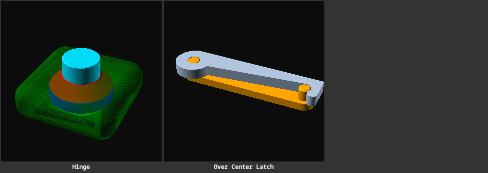
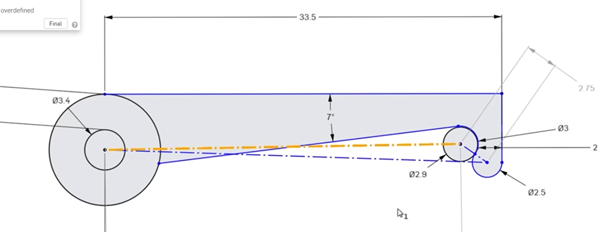
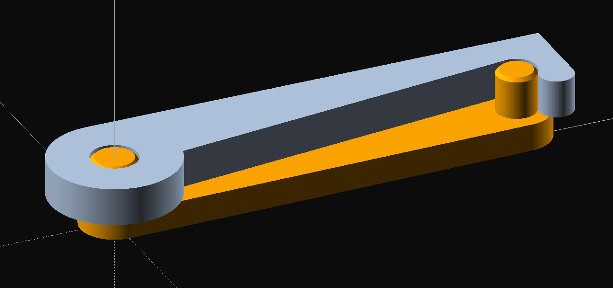
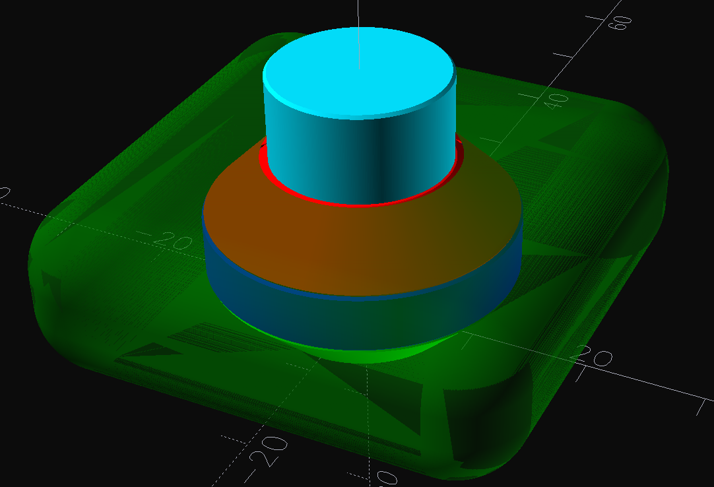
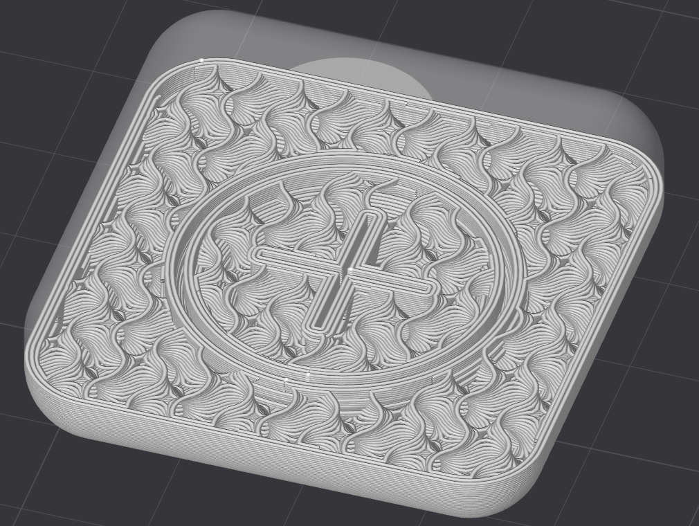
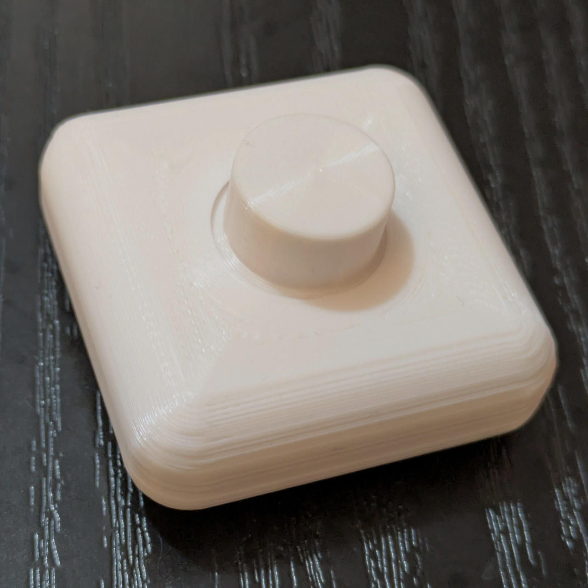

# Mechanisms

Reusable OpenSCAD mechanisms for moving or connecting printed parts.

> 

# Over-center Latch

[OpenSCAD source](./over-center-latch.scad)

A two-part snap hinge modelled on the dimensions of the sketch above: a flat
body plate with a Ø3.4 hub hole, a 7° lower edge and an open Ø3.0 socket, plus a
link whose end pin (Ø2.9) snaps into that socket. The link swings around the
hub pin and is held at the socket by the over-center geometry.

- `link_angle` shows the link in any position (0 = snapped in)
- `print_layout` switches from the assembly to a flat, print-ready layout
- Sketch dimensions (33.5 mm length, 2.75 mm thickness, 2 mm socket wall,
  Ø2.5 corner, 7° edge) and link size are parameters

> *Made by Claude Sonnet 5.5 from the sketch without any manual intervention.*

## Vertical Conical Hinge

[OpenSCAD source](./hinge.scad)

A parametric print-in-place hinge with conical interlocking surfaces. The source
includes a sample assembly to preview the hinge and its mating body.

Adjust `outer_diameter`, `inner_diameter`, and `height` to change the hinge
geometry; `size` controls the surrounding sample body. The fit clearance is
defined by the hidden `tolerance` value. Open the file in OpenSCAD to customize
the parameters and render the assembly.

> 
>
> 
>
> 
