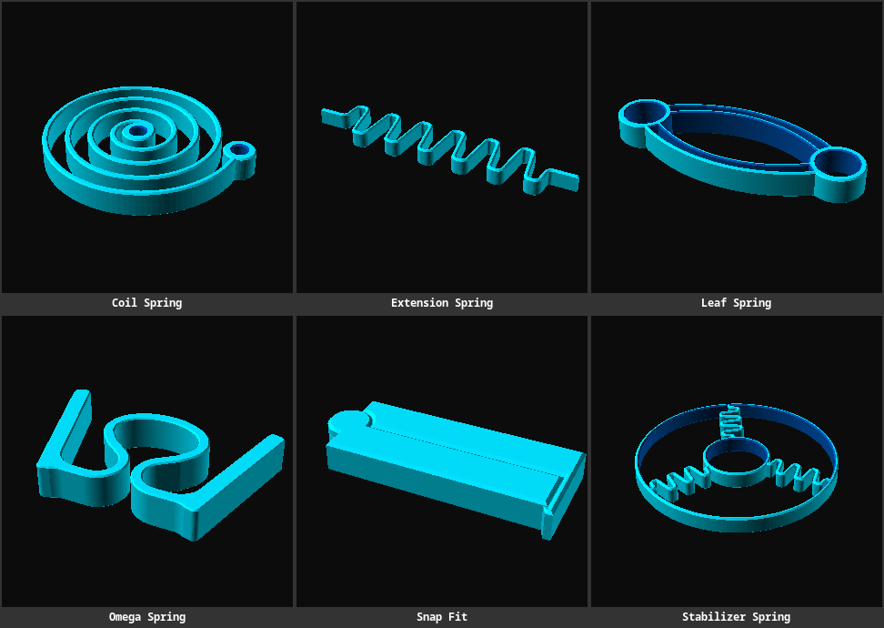

# Springs

Reusable OpenSCAD geometries for different kinds of springs.

> 

## Models

- [Coil spring](coil-spring.scad) - A spiral spring for storing energy.
- [Extension spring](extension-spring.scad) - The projection of a helical extension spring to a flat object.
- [Leaf spring](leaf-spring.scad) - Two bands forming a leaf spring for absorbing shocks or making opposite parts flex.
- [Omega spring](omega-spring.scad) - A bulky omega-shaped curve connected to opposite handles that can flex.
- [Snap fit](snap-fit.scad) - Two hinged bars that close via a snap-fit mechanism, like a simple bag clip.
- [Stabilizer spring](stabilizer-spring.scad) - A circle with 3 extension springs dampening movements of a smaller inner circle.
