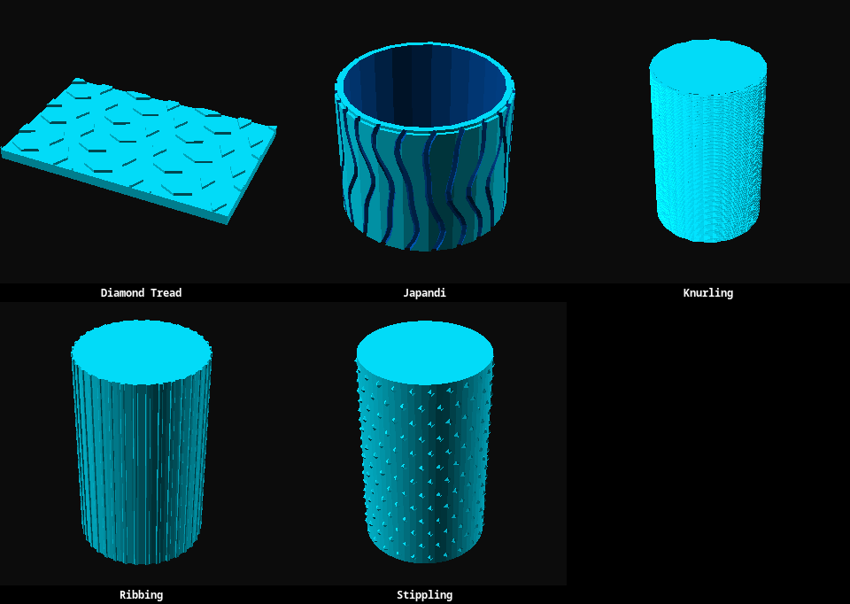

# Textures

Reusable OpenSCAD texture patterns and sample plates or containers that demonstrate them.

## Texture Examples

> 

- [Diamond tread](diamond-tread.scad) - A raised diamond pattern on a flat plate.
- [Japandi](japandi.scad) - An organic, vertically rippled cylinder.
- [Knurling](knurling.scad) - A repeating knurled surface pattern.
- [Ribbing](ribbing.scad) - A repeating ribbed surface pattern.
- [Stippling](stippling.scad) - A surface pattern made from small raised points.
